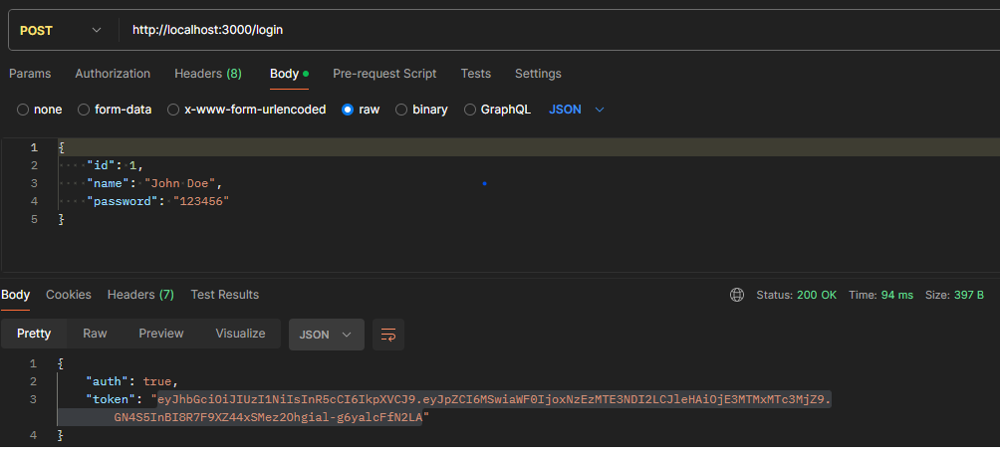
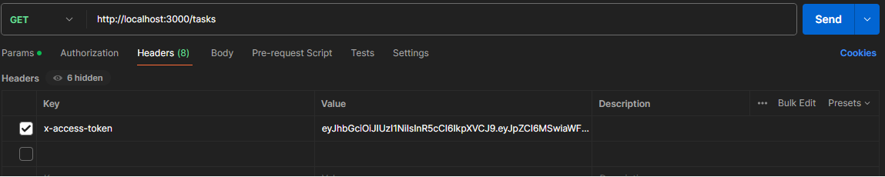
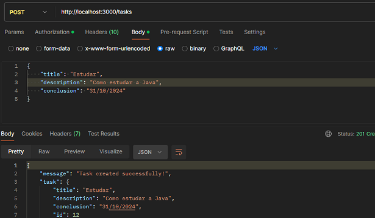
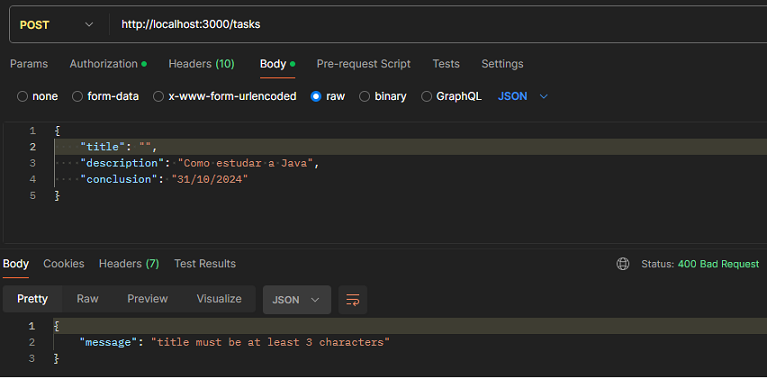
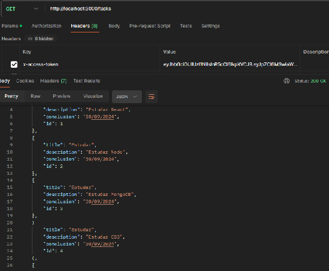
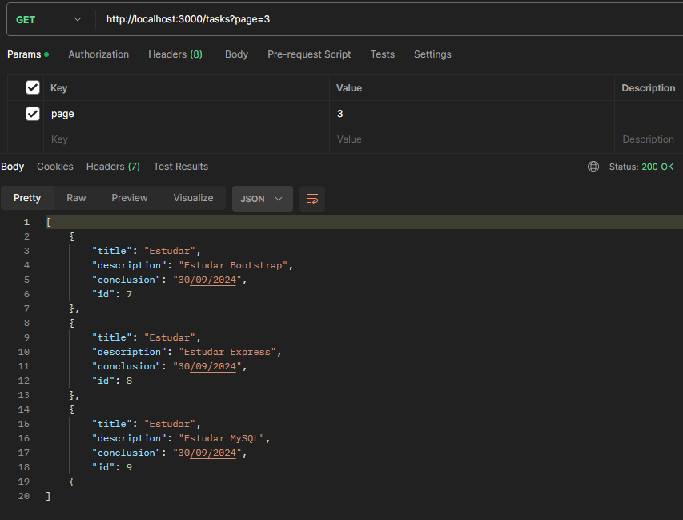

## Mini-Projeto CRUD

#### _Este mini projeto demonstra a implementação de um CRUD completo de tarefas em Node.js utilizando:_

**Express:** *Framework web para construção de APIs RESTful.*

**Biblioteca Yup:** *Validação robusta de dados de entrada.*

**JWT:** *Autenticação e autorização de usuários.*

**Paginação:** *Controle sobre grandes conjuntos de dados.*

**Validação:** *Garantia de dados consistentes e confiáveis.*

**Desenvolvimento com VScode:** *Editor de código moderno e eficiente.*

### Instalação
```
# Instalando o framework express 
npm install express --save
```
```
# Utilitário que reinicia automaticamente o servidor Node.js quando necessário.
npm install -g nodemon
```
```
# Instalando a biblioteca yup
npm install yup --save
```
```
# Instalando o JWT 
npm install jsonwebtoken
```
```
# Variável de ambiente, instalar localmente (recomendado)
npm install dotenv --save
```
```
# Para rodar o servidor
nodemon index.js
```

### Funcionalidades:

#### Login:



* Copie o Token gerado.
* Cole o token no headers do verbo que queira autenticar.
  


#### Criação de Tarefas:

* Validação de campos obrigatórios e formato correto.

* Atribuição de ID único.

* Leitura de Tarefas:

* Listagem de todas as tarefas ou filtragem por ID.

* Atualização de Tarefas:

* Validação de campos modificados e formato correto.

* Permissão para atualizar apenas campos específicos.

* Exclusão de Tarefas:

* Remoção de tarefas por ID.



* Validação Ok, tarefa criada



*Erro na validação.

#### Paginação:

* Controle do número de tarefas por página.

* Navegação entre páginas.

  
* Sem Paginação
  

* Com Paginação

#### Autenticação:

* Proteção das rotas CRUD com JWT.

* Geração e validação de tokens de acesso.

#### Criação de Tarefa:

*POST /tasks*

```
{

    "title": "Nova Tarefa",

    "description": "Descrição da Tarefa",

    "conclusion": "DD/MM/AAAA"

}
````
#### Leitura de Tarefas:

*GET /tasks*

#### Atualização de Tarefa:

*PUT /tasks/:id*
```
{

  "title": "Tarefa Atualizada",

  "description": "Descrição Atualizada da Tarefa",

  "conclusion": "DD/MM/AAAA"

}
```
#### Exclusão de Tarefa:

*DELETE /tasks/:id*

#### Recursos Adicionais:

* Paginação: Adicione parâmetros à rota GET /tasks para controlar o número de tarefas por página e navegar entre páginas.

* Autenticação: Implemente um middleware de autenticação para proteger as rotas CRUD. Utilize o JWT para gerar e validar tokens de acesso.

#### Testes:

* Utilize o Postman para testar as APIs CRUD com diferentes cenários:

* Campos obrigatórios ausentes ou inválidos.

* Formatos de dados incorretos.

* IDs inexistentes.

* Tokens de acesso inválidos.

**Observações:**

Este projeto é um exemplo básico e pode ser adaptado de acordo com suas necessidades.
